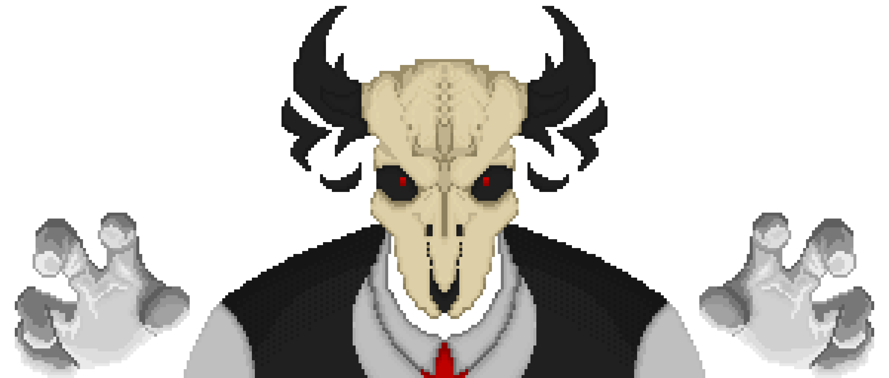
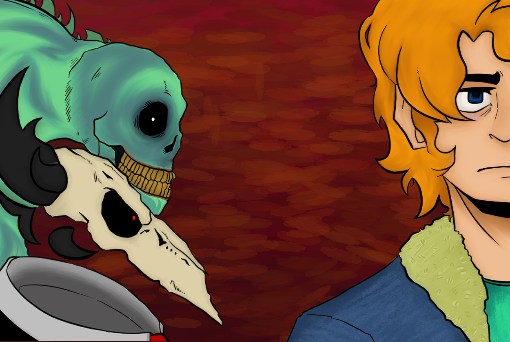

## Overview

**Go On!** is my first game: a bullet-hell platformer about **Max**, a university student struggling with the stresses and challenges of academic life.

This project was a significant milestone in my journey as a game developer. I went from having virtually no programming experience beyond Scratch to creating a fully realized game in Unity.

### [Download Go On!](</GDPortfolio/public/assets/GO ON!.zip>)

## Visuals & Gameplay Showcase
### Gameplay Footage

<video controls src="../../../public/assets/GOON_Gameplay.mp4" title="Title"></video>
<video controls src="../../../public/assets/boss2.mp4" title="Title"></video>

## Challenges & Learning

When I started this project, my programming experience was limited to **Scratch**. I dedicated the first week to intensive self-learning, exploring programming concepts and development techniques that were completely new to me.

This crash course allowed me to develop the skills necessary to turn the game's initial concept into a functional and engaging experience.

The project became an important learning experience in understanding how different gameplay, technical, and production systems come together to create a complete game.

## Design Inspiration

The main inspiration for **Go On** was **Just Shapes & Beats**, a rhythmic bullet-hell game that had captivated me years earlier.

Its influence can be seen in the game's dynamic bullet patterns, fast-paced encounters, and emphasis on movement and evasion.

## Movement Mechanics

Max's movement system takes inspiration from games such as **Hollow Knight** and **Mega Man X**.

Because I was still learning how to design and implement combat systems, I chose to focus the gameplay primarily around **evasion rather than direct combat**.

This resulted in a gameplay experience where the player must carefully navigate through bullet patterns, obstacles, and enemies while maintaining control of Max's movement.

## Technical Development

Throughout development, I worked with a variety of Unity systems and programming techniques, including:

- Universal Render Pipeline (URP)
- Post-processing effects
- Object instantiation
- Screen-based positioning
- Coroutines
- Input handlers
- Scene management
- Asynchronous scene loading
- Audio visualizers
- Timeline systems
- Audio systems

Working with these systems gave me my first experience building interconnected gameplay and technical features rather than isolated programming exercises.

## Team Collaboration

The project was developed by a team of three.

I was responsible for **all programming and technical implementation**, while my teammates focused on the visual and level-design aspects of the game.

### Team

- **Me** — Gameplay Programming
- **Miguel Ángel Grisales** — Level Design
- **Valeria Quintero Cuervo** — Art — [@KrowKrapp](https://www.instagram.com/Krowkrapp/)

The collaboration allowed us to combine programming, art, and level design into a cohesive final experience.

## What I Learned

**Go On** was a challenging but extremely rewarding first step into game development.

Starting with only Scratch experience, I had to quickly learn programming, Unity, game systems, and development workflows while simultaneously building the game.

The project significantly improved my programming skills and taught me how to approach game development as a complete process rather than simply writing code.

Most importantly, creating a bullet-hell platformer from scratch gave me the foundation that started my journey as a game developer.

## Project Details

**Team Size:** 3  
**Project Length:** 4 months  
**Engine:** Unity  
**Tools:** Adobe Creative Suite, Google Docs

### My Role

**Gameplay Programmer**

I was responsible for the game's programming and technical implementation, including gameplay systems, player movement, scene management, audio systems, and visual effects.

